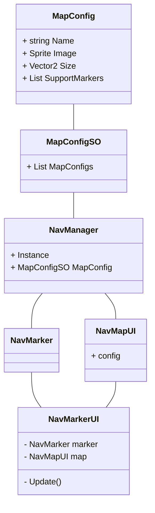

# NavMap4U 开发文档

## 需求

* 可以有多张地图存在
  * 小地图（雷达图、小地图）
  * 大地图
* 地图可以看到角色的位置
  * 方案一：地图固定，角色标记移动（MOBA）
  * 方案二：角色标记固定位置，地图固定旋转
  * 方案三：角色标记固定位置及旋转，地图移动和旋转（雷达图）
* 地图切换
  * 首次进入场景时，初始化地图
  * 进入特定区域切换地图
    * 高度地图（楼层地图）
    * 区域地图（室内图）
  * 不同缩放切换地图
* 地图交互
  * 标记的增删改查
    * 添加标记
    * 移除标记
    * 修改标记
    * 查找标记
  * 地图缩放

## 架构

### NavManager

单例，最顶层的管理器类，负责管理所有的地图

#### 功能

* 地图的增删改查
* 标记的增删改查

### NavMapUI

地图的显示层，地图的逻辑层直接包含在 NavManager 中

#### 功能

* 显示更新
  * 位置、旋转、缩放

### NavMarker

标记的逻辑层

#### 功能

* 读取标记源信息，更新显示层

### NavMarkerUI

标记的显示层

#### 功能

* 显示更新
  * 位置、旋转（缩放）
  * 显示、隐藏
  * 其他
* 查找对应的逻辑层

### MapConfig

地图配置信息

* 地图名
* 地图图片
* 地图大小
* 地图支持的标记类型

### MapConfigSO

地图配置信息列表

## 类图

